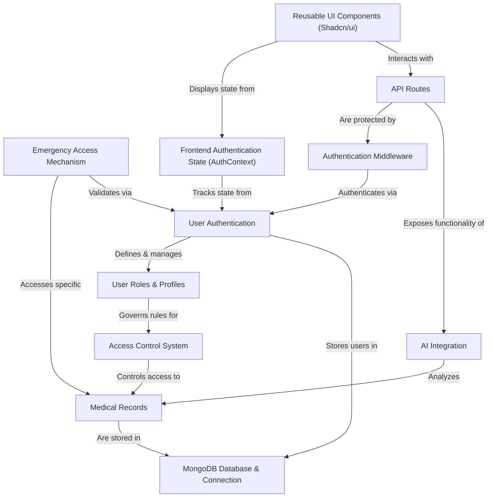
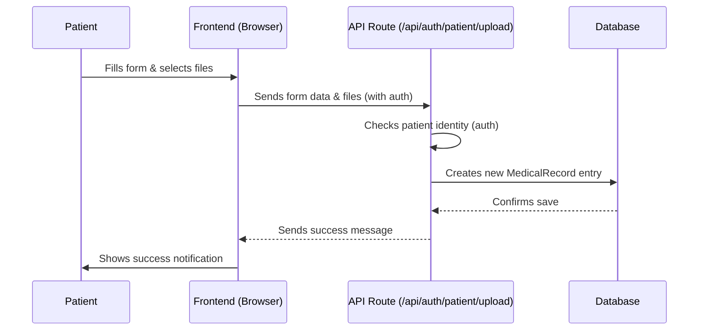
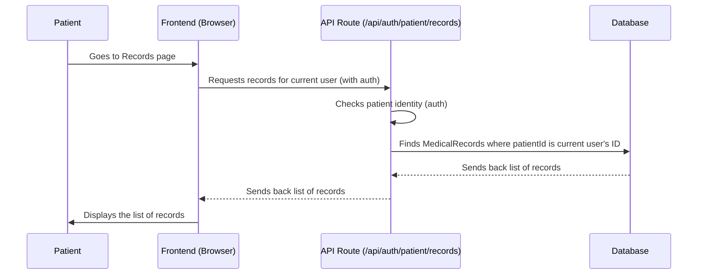
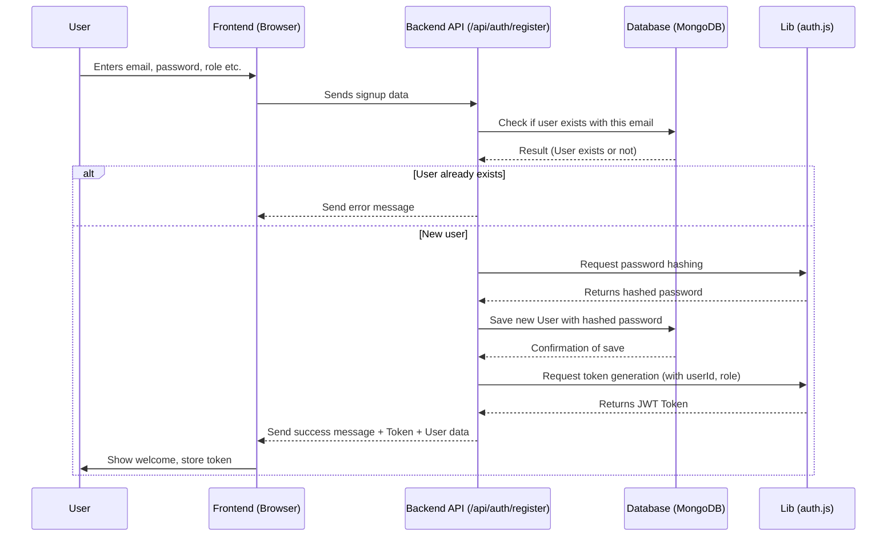
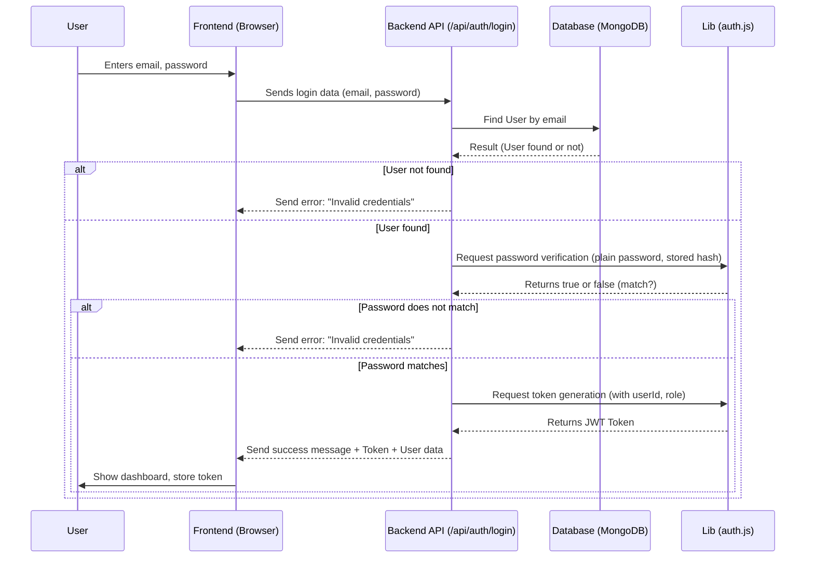

# Tutorial: TestingBreathline

Breathline is a secure digital health platform designed to empower patients
to manage their **medical records**. It allows **patients** to upload, organize,
and control access permissions for their health data. **Doctors** can request
and view relevant patient records, and **emergency responders** have a specialized
mechanism for *quick, secure access* to critical information via a QR code
during emergencies. The platform ensures data privacy and security through
**user authentication**, **roles**, and a robust **access control system**,
stores data in a **MongoDB database**, provides functionality via **API routes**,
and utilizes **AI integration** for health insights and diagnostic support.


## Visual Overview



## Chapters

1. [Medical Records
](01_medical_records_.md)
2. [User Authentication
](02_user_authentication_.md)
3. [User Roles & Profiles
](03_user_roles___profiles_.md)
4. [Access Control System
](04_access_control_system_.md)
5. [Emergency Access Mechanism
](05_emergency_access_mechanism_.md)
6. [MongoDB Database & Connection
](06_mongodb_database___connection_.md)
7. [API Routes
](07_api_routes_.md)
8. [Authentication Middleware
](08_authentication_middleware_.md)
9. [AI Integration
](09_ai_integration_.md)
10. [Frontend Authentication State (AuthContext)
](10_frontend_authentication_state__authcontext__.md)
11. [Reusable UI Components (Shadcn/ui)
](11_reusable_ui_components__shadcn_ui__.md)

---

# Chapter 1: Medical Records

Welcome to the `TestingBreathline` project tutorial! In this first chapter, we're going to explore the core concept behind the project: **Medical Records**.

Imagine your personal health information – doctor's notes, lab results, prescriptions, maybe even scans. Traditionally, these are scattered across different doctors' offices, often on paper. Finding everything you need or sharing it with a new doctor can be a hassle.

The `TestingBreathline` project aims to solve this by creating a **secure, digital file cabinet** for your health. This file cabinet holds your "Medical Records".

## What is a Medical Record Here?

In `TestingBreathline`, a Medical Record is a digital entry that represents a piece of your health history. It's like one folder or one document within that digital file cabinet.

Each digital Medical Record can contain:

*   **A Title:** A short name like "Annual Physical Exam Report" or "Blood Test Results - March 2024".
*   **A Description:** More details about the record, like what was discussed or what the results showed.
*   **A Category:** To help organize – is it a `lab-result`, a `prescription`, a `consultation`, or something else?
*   **Attached Files:** The actual documents, images (like scans), or PDFs related to the record. Think of attaching the actual PDF of your lab results.
*   **Other Information:** Like the date the record is for, and whether it's important for emergencies.

Crucially, **patients are the primary owners** of these records. They control what records exist and, eventually, who can see them.

## Your First Use Case: Uploading Lab Results

Let's walk through a simple but important use case: You just got your blood test results back as a PDF, and you want to store it securely in your `TestingBreathline` account.

Here's how you might do it using the application's upload feature:

1.  You go to the "Upload Documents" section.
2.  You fill in some details about the results, like giving it a `Title` ("Blood Test Results - March 2024") and a brief `Description` ("Cholesterol and sugar levels checked").
3.  You select the PDF file from your computer.
4.  You choose the `Category` "Lab Results".
5.  You click "Upload".

What happens behind the scenes is that `TestingBreathline` takes this information and the file, creates a new digital Medical Record entry for *you*, and stores it securely.

Let's look at tiny pieces of code that handle this.

### Filling the Form (Frontend)

On the page where you upload documents (`app/dashboard/patient/upload/page.jsx`), there's a form. Here's a simplified look at some of the form inputs:

```jsx
// Inside app/dashboard/patient/upload/page.jsx
// ... other imports and state ...

<form onSubmit={handleUpload} className="space-y-4">
  {/* Title Input */}
  <div className="space-y-2">
    <Label htmlFor="title">Document Title</Label>
    <Input id="title" /* ... other props */ required />
  </div>

  {/* Category Select */}
  <div className="space-y-2">
    <Label htmlFor="category">Category</Label>
    <Select /* ... other props */>
      <SelectTrigger><SelectValue /></SelectTrigger>
      <SelectContent>
        <SelectItem value="general">General</SelectItem>
        <SelectItem value="lab-results">Lab Results</SelectItem>
        {/* ... other categories ... */}
      </SelectContent>
    </Select>
  </div>

  {/* Description Textarea */}
  <div className="space-y-2">
    <Label htmlFor="description">Description</Label>
    <Textarea id="description" /* ... other props */ rows={3} />
  </div>

  {/* File Input */}
  <div className="space-y-2">
    <Label>Files</Label>
    <input type="file" multiple id="file-upload" /* ... other props */ />
    {/* ... custom label to trigger the input ... */}
  </div>

  <Button type="submit" /* ... other props */>Upload Documents</Button>
</form>
```

This frontend code creates the visual form elements (input boxes, dropdowns) that you interact with. When you type or select something, it updates internal temporary storage (called "state").

### Sending to the Server (Frontend & Backend)

When you click "Upload", the frontend gathers all the form data and the selected file(s) and sends them to the server.

A simplified look at the upload logic in `app/dashboard/patient/upload/page.jsx`:

```javascript
// Inside handleUpload function in app/dashboard/patient/upload/page.jsx
// ... get form data and files ...

const uploadFormData = new FormData();
files.forEach(({ file }) => {
  uploadFormData.append('files', file);
});

// Append other form data
uploadFormData.append('title', formData.title);
uploadFormData.append('description', formData.description);
uploadFormData.append('category', formData.category);
// ... append other fields ...

const response = await fetch('/api/auth/patient/upload', {
  method: 'POST',
  body: uploadFormData, // Send the form data including files
  // ... include authorization header (explained in Chapter 8) ...
});

if (response.ok) {
  // Success! The server created the record.
  toast.success('Files uploaded successfully!');
  // ... reset form, etc. ...
} else {
  // Handle error
  toast.error('Upload failed.');
}
```

The frontend uses `fetch` to send the data to a specific address on the server: `/api/auth/patient/upload`. This address is handled by a piece of backend code called an API route.

Now, a simplified look at the backend API route (`app/api/auth/patient/upload/route.js`) that receives this data:

```javascript
// Inside app/api/auth/patient/upload/route.js
import MedicalRecord from '@/models/MedicalRecord';
// ... other imports ...

export async function POST(request) {
  // ... authentication check (explained in Chapter 8) ...
  const { user } = auth; // We know WHO is uploading

  const formData = await request.formData();
  const files = formData.getAll('files'); // Get uploaded files
  const title = formData.get('title');     // Get title
  const description = formData.get('description'); // Get description
  const category = formData.get('category'); // Get category
  // ... get other fields ...

  // Prepare data for the database
  const fileData = files.map(file => ({
      filename: `${Date.now()}_${file.name}`,
      originalName: file.name,
      mimetype: file.type,
      size: file.size,
      // ... other file details (path, encryption) ...
  }));

  // Create a new MedicalRecord object based on the form data
  const record = new MedicalRecord({
    patientId: user._id, // Link the record to the patient
    title: title || 'Uploaded Document',
    description: description || '',
    category: category || 'general',
    files: fileData,
    // ... other metadata ...
  });

  // Save the record to the database
  await record.save();

  // Send a success response back to the frontend
  return Response.json({ message: 'Files uploaded successfully', record }, { status: 201 });
}
```

This backend code receives the uploaded files and form data. It then uses this information to create a new `MedicalRecord` entry and saves it in the database. Notice how `patientId` is automatically set to the `user._id` – this links the record directly to the patient who uploaded it.

## Viewing Your Records

Once records are uploaded, you'll want to see them. The "Medical Records" page (`app/dashboard/patient/records/page.jsx`) shows you a list of all your digital health documents.

A simplified look at fetching records in `app/dashboard/patient/records/page.jsx`:

```javascript
// Inside MedicalRecords component in app/dashboard/patient/records/page.jsx
// ... other state and imports ...

useEffect(() => {
  fetchRecords(); // Fetch records when the page loads or filters change
}, [categoryFilter, pagination.page]); // Refetch if filter or page changes

const fetchRecords = async () => {
  try {
    // Send a request to the server to get records for this patient
    const response = await fetch(`/api/auth/patient/records?category=${categoryFilter}&page=${pagination.page}`, {
      headers: {
        'Authorization': `Bearer ${localStorage.getItem('token')}`,
      },
    });

    if (response.ok) {
      const data = await response.json();
      setRecords(data.records || []); // Store the records in state
      setPagination(data.pagination); // Store pagination info
    } else {
      throw new Error('Failed to fetch records');
    }
  } catch (error) {
    toast.error('Failed to fetch records');
  } finally {
    setLoading(false);
  }
};

// ... later in the component, map through 'records' state to display them ...
```

The frontend code sends a request to another API route (`/api/auth/patient/records`).

Here's a simplified look at the backend API route (`app/api/auth/patient/records/route.js`) that handles fetching:

```javascript
// Inside app/api/auth/patient/records/route.js
import MedicalRecord from '@/models/MedicalRecord';
// ... other imports ...

export async function GET(request) {
  // ... authentication check ...
  const { user } = auth; // We know WHO is requesting

  // ... get filter and pagination parameters from request.url ...

  // Build a database query
  const query = { patientId: user._id }; // ONLY get records for this patient!
  // ... add category filter if needed ...

  // Find records in the database matching the query
  const records = await MedicalRecord.find(query)
    .sort({ createdAt: -1 }) // Show newest first
    // ... add limit and skip for pagination ...
    // ... populate doctor info if linked ...;

  // Count total records for pagination
  const total = await MedicalRecord.countDocuments(query);

  // Send the list of records and pagination back to the frontend
  return Response.json({
    records,
    pagination: { total, page, limit, pages: Math.ceil(total / limit) },
  });
}
```

This backend code finds all `MedicalRecord` entries linked to the logged-in patient's ID (`patientId: user._id`) and sends them back to the frontend to be displayed.

## Behind the Scenes: The Medical Record Data Structure

Let's take a quick look at the blueprint used to create Medical Records in the database. This blueprint is defined in `models/MedicalRecord.js`:

```javascript
// Inside models/MedicalRecord.js
import mongoose from 'mongoose';

const medicalRecordSchema = new mongoose.Schema({
  patientId: {
    type: mongoose.Schema.Types.ObjectId, // This links to the User who is the patient
    ref: 'User',
    required: true,
  },
  title: { // The short name for the record
    type: String,
    required: true,
  },
  description: String, // More details about the record
  category: { // Type of record (lab-results, etc.)
    type: String,
    enum: ['general', 'lab-results', 'prescription', 'imaging', 'emergency', 'consultation'],
    default: 'general',
  },
  files: [{ // List of attached files
    filename: String,
    originalName: String,
    mimetype: String, // Type of file (PDF, JPG)
    size: Number,
    path: String, // Where the file is stored (simplified here)
    encrypted: { type: Boolean, default: true }, // Files are encrypted!
  }],
  metadata: { // Other important info
    recordDate: { type: Date, default: Date.now }, // Date of the record itself
    doctorId: { // Doctor who might be associated (optional)
      type: mongoose.Schema.Types.ObjectId,
      ref: 'User',
    },
    isEmergencyVisible: { type: Boolean, default: false }, // Can this be seen in emergency?
  },
  accessPermissions: [{ // Who else has access (explained later)
    doctorId: { /* ... */ },
    granted: { /* ... */ },
    grantedAt: Date,
    expiresAt: Date,
    accessLevel: { /* ... */ }, // Read or Write access
  }],
}, {
  timestamps: true, // Adds createdAt and updatedAt timestamps
});

export default mongoose.models.MedicalRecord || mongoose.model('MedicalRecord', medicalRecordSchema);
```

This schema tells the database exactly what information to store for each Medical Record and what type of data each piece is (text, number, date, list of files, link to a user). The `patientId` field is key, linking the record back to its owner.

### Simplified Process Flows

Here's a very basic look at how information flows when you upload or view:

**Uploading a Record:**



**Viewing Your Records:**



These diagrams show the basic steps. The "auth" part (checking who you are) is really important and something we'll dive into in the next chapter.

## Summary

In this chapter, we introduced the concept of Medical Records in `TestingBreathline` as secure digital documents owned by patients. We saw how they store key information like title, description, category, and attached files. We walked through the basic use case of uploading a lab result and viewing your existing records, getting a first look at how the frontend and backend work together to create and retrieve these digital health entries.

The foundation of managing these records securely depends heavily on knowing who is trying to access or modify them. This leads us directly to the next crucial topic: figuring out how the application knows *you* are the patient accessing *your* records.

Ready to learn how the application identifies users? Let's move on to the next chapter!

[Chapter 2: User Authentication](02_user_authentication_.md)

---

<sub><sup>Generated by [AI Codebase Knowledge Builder](https://github.com/The-Pocket/Tutorial-Codebase-Knowledge).</sup></sub> <sub><sup>**References**: [[1]](https://github.com/vaibhavguptahere/TestingBreathline/blob/431a03ff9db6c836bb1d4a0b66e70af17c7e7ce0/app/api/auth/patient/records/route.js), [[2]](https://github.com/vaibhavguptahere/TestingBreathline/blob/431a03ff9db6c836bb1d4a0b66e70af17c7e7ce0/app/api/auth/patient/upload/route.js), [[3]](https://github.com/vaibhavguptahere/TestingBreathline/blob/431a03ff9db6c836bb1d4a0b66e70af17c7e7ce0/app/dashboard/patient/records/edit/[recordId]/page.jsx), [[4]](https://github.com/vaibhavguptahere/TestingBreathline/blob/431a03ff9db6c836bb1d4a0b66e70af17c7e7ce0/app/dashboard/patient/records/page.jsx), [[5]](https://github.com/vaibhavguptahere/TestingBreathline/blob/431a03ff9db6c836bb1d4a0b66e70af17c7e7ce0/app/dashboard/patient/upload/page.jsx), [[6]](https://github.com/vaibhavguptahere/TestingBreathline/blob/431a03ff9db6c836bb1d4a0b66e70af17c7e7ce0/models/MedicalRecord.js)</sup></sub>

# Chapter 2: User Authentication

Welcome back to the `TestingBreathline` tutorial!

In [Chapter 1: Medical Records](01_medical_records_.md), we learned about the core idea of storing your health information securely as digital records, owned primarily by you, the patient. We saw how uploading a lab result or viewing your records involves sending information between your browser (the "frontend") and the application's server (the "backend"), which interacts with the database.

But there was a crucial piece we only touched on: how does the system know *who* you are? How does it make sure that when you try to upload a record, it's *your* record being created, and when you view records, you only see *your* records, not someone else's?

This is where **User Authentication** comes in.

## What is User Authentication?

Think of `TestingBreathline` as a secure building containing your valuable medical records. User Authentication is like the security guard at the entrance.

*   **It verifies who you are.** When you arrive, you need to show your ID.
*   **It checks if you're allowed in.** Is your ID valid? Are you on the list of authorized people?
*   **Once inside, it might give you a temporary pass.** This pass lets you move around certain areas without showing your main ID every single time.

In software terms, User Authentication is the process of proving that you are the person or user you claim to be.

For `TestingBreathline`, this system handles a few key things:

1.  **Signing Up:** Allowing new users (patients, doctors, emergency responders) to create an account and get their "ID".
2.  **Logging In:** Letting returning users show their credentials (like email and password) to prove they are who they say they are.
3.  **Staying Logged In:** Giving users a special code (like that temporary pass) after they log in successfully, so the application remembers them for a while. This means you don't have to type your password every time you click a link or upload something.

Without authentication, anyone could potentially access or mess with anyone else's medical records – which is absolutely not okay for something as sensitive as health data!

## Your Use Case: Signing Up and Logging In

Before you can upload that lab result or view your history, you first need an account.

Let's walk through the essential steps you take as a user:

1.  **You go to the Sign Up page.** You provide basic information like email, password, and maybe your role (Patient, Doctor, Emergency Responder).
2.  **You click "Sign Up".** The application checks if someone with that email already exists. If not, it securely stores your information (especially your password in a scrambled way) and creates your account. It then probably logs you in automatically or directs you to the login page.
3.  **You go to the Login page.** You enter your email and password.
4.  **You click "Login".** The application finds your account based on the email, checks if the password you entered matches the scrambled one it stored, and if everything is correct, it confirms your identity and gives you that temporary pass (a "token").
5.  **You are now logged in.** The application knows who you are, and you can access features like uploading or viewing your records, often using that token to prove your identity for each action.

## Key Concepts in `TestingBreathline` Authentication

Let's break down the pieces that make this work:

### 1. Storing User Information Securely

The application needs a place to keep track of its users. This is done in the database, similar to how Medical Records are stored.

The blueprint for user information is defined in the `models/User.js` file. It tells the database what kind of data each user entry should hold.

```javascript
// Inside models/User.js
import mongoose from 'mongoose';

const userSchema = new mongoose.Schema({
  email: { type: String, required: true, unique: true }, // Your unique username
  password: { type: String, required: true }, // Your password (will be hashed)
  role: { // What kind of user are you?
    type: String,
    enum: ['patient', 'doctor', 'emergency', 'admin'],
    required: true,
  },
  profile: { // Specific info based on role
    firstName: String,
    lastName: String,
    phone: String,
    // Doctor specific fields
    licenseNumber: String,
    specialization: String,
    hospital: String,
    // Emergency specific fields
    badgeNumber: String,
    department: String,
    // Verification status
    verified: { type: Boolean, default: false },
  },
  isActive: { type: Boolean, default: true }, // Can this account be used?
  lastLogin: Date, // When did they last log in?
}, {
  timestamps: true, // Adds createdAt and updatedAt
});

export default mongoose.models.User || mongoose.model('User', userSchema);
```

Notice the `password` field. It stores the password, but *not* in plain text! It's stored in a scrambled, unreadable format thanks to password hashing.

### 2. Password Hashing

When you sign up or change your password, the application doesn't save the actual password you typed (e.g., "mysecretpassword123"). Instead, it uses a one-way mathematical function (a "hash") to turn your password into a long string of characters that looks random (e.g., "a1b2c3d4e5f6..."). This process is called hashing.

*   You can easily hash a password to get the random string.
*   But you *cannot* easily get the original password back from the random string.

When you try to log in, the application takes the password you entered, hashes *that* password, and compares the resulting hash to the stored hash. If the hashes match, it knows you entered the correct password without ever having to store or see the original password.

This protects your password even if someone were to gain unauthorized access to the database. They would only see the hashes, which are useless for logging in.

The code for hashing and verifying passwords is in `lib/auth.js`:

```javascript
// Inside lib/auth.js
import bcrypt from 'bcryptjs'; // Library for hashing

export async function hashPassword(password) {
  // Use bcrypt to hash the password securely
  return await bcrypt.hash(password, 12);
}

export async function verifyPassword(password, hashedPassword) {
  // Use bcrypt to compare a plain password with a stored hash
  return await bcrypt.compare(password, hashedPassword);
}

// ... other functions ...
```

This uses the `bcryptjs` library, which is a standard tool for secure password hashing.

### 3. JWT Tokens (The Temporary Pass)

Once you've successfully logged in, the server gives your browser a special string of characters called a **JSON Web Token (JWT)**. This token is like your temporary pass.

```javascript
// Inside lib/auth.js

import jwt from 'jsonwebtoken'; // Library for creating/verifying tokens

const JWT_SECRET = process.env.JWT_SECRET || 'your-secret-key'; // Secret key for security

export function generateToken(payload) {
  // Creates a token containing some basic info (like userId and role)
  return jwt.sign(payload, JWT_SECRET, { expiresIn: '7d' }); // Token expires in 7 days
}

export function verifyToken(token) {
  try {
    // Checks if a token is valid and hasn't expired
    return jwt.verify(token, JWT_SECRET);
  } catch (error) {
    // If verification fails (e.g., expired or invalid token), return null
    return null;
  }
}

// ... other functions ...
```

This `generateToken` function takes some basic information (like the user's ID and role) and uses a secret key to create the token. The `verifyToken` function does the reverse: it takes a token and, using the same secret key, checks if it's valid and pulls out the original information.

Your browser stores this token (usually in `localStorage`). For subsequent actions (like uploading or viewing records, as seen in Chapter 1), your browser includes this token in the request it sends to the server. The server can then use the `verifyToken` function to quickly check your temporary pass, figure out who you are, and confirm you're allowed to perform the action without needing your full password again.

We saw hints of this in Chapter 1, where the frontend fetch requests included an `Authorization` header with the token:

```javascript
// Simplified from Chapter 1 fetch call
const response = await fetch('/api/auth/patient/records', {
  headers: {
    // Include the token in the request header
    'Authorization': `Bearer ${localStorage.getItem('token')}`,
  },
  // ...
});
```

This header is how the frontend sends the temporary pass (the JWT token) back to the backend for verification on every protected request.

## The Authentication Process Flows

Let's visualize the signup and login processes:

### Signing Up Flow



### Logging In Flow



### Using the Token (for protected actions)

```mermaid
sequenceDiagram
    participant User
    participant Frontend (Browser)
    participant Backend API (e.g., /api/auth/patient/records)
    participant Middleware (authenticateToken)
    participant Database (MongoDB)
    participant Lib (auth.js)

    User->>Frontend (Browser): Tries to access protected feature (e.g., view records)
    Note over Frontend (Browser): Frontend retrieves stored token
    Frontend (Browser)->>Backend API (e.g., /api/auth/patient/records): Sends request with token in Authorization header
    Backend API (e.g., /api/auth/patient/records)->>Middleware (authenticateToken): Pass the request to middleware
    Middleware (authenticateToken)->>Lib (auth.js): Request token verification
    Lib (auth.js)-->>Middleware (authenticateToken): Returns user info if valid, null otherwise
    alt Token is invalid or missing
        Middleware (authenticateToken)-->>Backend API (e.g., /api/auth/patient/records): Send authentication error (e.g., 401)
        Backend API (e.g., /api/auth/patient/records)-->>Frontend (Browser): Send authentication error
        Frontend (Browser)->>User: Show error or redirect to login
    else Token is valid
        Middleware (authenticateToken)-->>Backend API (e.g., /api/auth/patient/records): Continues with request, provides user info
        Note over Backend API (e.g., /api/auth/patient/records): Now knows who the user is (e.g., userId, role)
        Backend API (e.g., /api/auth/patient/records)->>Database (MongoDB): Performs action for this specific user (e.g., find records by userId)
        Database (MongoDB)-->>Backend API (e.g., /api/auth/patient/records): Results
        Backend API (e.g., /api/auth/patient/records)-->>Frontend (Browser): Send results
        Frontend (Browser)->>User: Display results
    end
```

This last diagram shows how the token connects Authentication to accessing specific features. The `Middleware` is a piece of code that runs *before* the main API route logic to check the token. We'll cover this in more detail in [Chapter 8: Authentication Middleware](08_authentication_middleware_.md).

## Looking at the Code: Simplified API Routes

Let's look at very simplified snippets from the API routes responsible for registration and login.

### Registration (`app/api/auth/register/route.js`)

This is the backend code that handles the Sign Up request.

```javascript
// Inside app/api/auth/register/route.js
import connectDB from '@/lib/mongodb'; // Connects to database
import User from '@/models/User'; // The user blueprint
import { hashPassword, generateToken } from '@/lib/auth'; // Our auth functions

export async function POST(request) {
  // ... connect to DB ...
  const body = await request.json(); // Get data from frontend
  const { email, password, role, firstName, lastName } = body; // Extract key fields

  // 1. Check if user exists
  const existingUser = await User.findOne({ email });
  if (existingUser) {
    return Response.json({ error: 'User already exists' }, { status: 400 });
  }

  // 2. Hash password
  const hashedPassword = await hashPassword(password);

  // 3. Prepare user profile data
  const profile = { firstName, lastName };
  // ... add role-specific profile fields ...

  // 4. Create new user object
  const user = new User({
    email,
    password: hashedPassword, // Store the hashed password
    role,
    profile,
  });

  // 5. Save user to database
  await user.save();

  // 6. Generate token for the new user
  const token = generateToken({ userId: user._id, role: user.role });

  // 7. Send success response with token and user data
  return Response.json(
    { message: 'User created', token, user: { id: user._id, email: user.email, role: user.role } },
    { status: 201 } // 201 means "Created"
  );
  // ... handle errors ...
}
```

This code receives the user's details, makes sure the email is unique, uses `hashPassword` to scramble the password, creates a new user record in the database, and finally uses `generateToken` to create a token for the user, sending it back to the frontend.

### Login (`app/api/auth/login/route.js`)

This is the backend code that handles the Login request.

```javascript
// Inside app/api/auth/login/route.js
import connectDB from '@/lib/mongodb'; // Connects to database
import User from '@/models/User'; // The user blueprint
import { verifyPassword, generateToken } from '@/lib/auth'; // Our auth functions

export async function POST(request) {
  // ... connect to DB ...
  const body = await request.json(); // Get data from frontend
  const { email, password } = body; // Extract email and password

  // 1. Find user by email
  const user = await User.findOne({ email });
  if (!user) {
    // User not found
    return Response.json({ error: 'Invalid email or password' }, { status: 401 });
  }

  // 2. Verify password
  const isValidPassword = await verifyPassword(password, user.password); // Compare entered password with stored hash
  if (!isValidPassword) {
    // Password doesn't match
    return Response.json({ error: 'Invalid email or password' }, { status: 401 });
  }

  // 3. Check if user is active (optional but good practice)
  if (!user.isActive) {
      return Response.json({ error: 'Account deactivated' }, { status: 401 });
  }

  // 4. Generate token for the logged-in user
  const token = generateToken({ userId: user._id, role: user.role });

  // 5. Send success response with token and user data
  const userData = { id: user._id, email: user.email, role: user.role }; // Prepare data to send
  return Response.json({ message: 'Login successful', token, user: userData });
  // ... handle errors ...
}
```

This code receives the user's email and password, finds the user in the database by email, uses `verifyPassword` to check if the provided password is correct (by comparing hashes), and if it is, uses `generateToken` to issue a new token, sending it back to the frontend.

These API routes are the secure doors users interact with to enter the system. Once inside, the JWT token becomes their temporary pass to move around and access their medical records.

## Summary

In this chapter, we explored **User Authentication**, the system that verifies who you are in `TestingBreathline`. We learned why it's essential for security, especially when dealing with sensitive medical data. We covered the core processes of signing up and logging in, and how the application uses password hashing for security and JWT tokens as temporary passes so you don't have to re-authenticate for every action. We saw simplified code snippets for the API routes handling registration and login, and understood how the user information is stored securely in the database.

Now that we know *who* a user is, the next logical step is to understand *what kind* of user they are (Patient, Doctor, etc.) and what information is associated with that. This leads us to the concept of User Roles and Profiles.

Ready to understand the different types of users in the system? Let's move on to the next chapter!

[Chapter 3: User Roles & Profiles](03_user_roles___profiles_.md)

---

<sub><sup>Generated by [AI Codebase Knowledge Builder](https://github.com/The-Pocket/Tutorial-Codebase-Knowledge).</sup></sub> <sub><sup>**References**: [[1]](https://github.com/vaibhavguptahere/TestingBreathline/blob/431a03ff9db6c836bb1d4a0b66e70af17c7e7ce0/app/api/auth/doctor/change-password/route.js), [[2]](https://github.com/vaibhavguptahere/TestingBreathline/blob/431a03ff9db6c836bb1d4a0b66e70af17c7e7ce0/app/api/auth/emergency/change-password/route.js), [[3]](https://github.com/vaibhavguptahere/TestingBreathline/blob/431a03ff9db6c836bb1d4a0b66e70af17c7e7ce0/app/api/auth/login/route.js), [[4]](https://github.com/vaibhavguptahere/TestingBreathline/blob/431a03ff9db6c836bb1d4a0b66e70af17c7e7ce0/app/api/auth/register/route.js), [[5]](https://github.com/vaibhavguptahere/TestingBreathline/blob/431a03ff9db6c836bb1d4a0b66e70af17c7e7ce0/lib/auth.js), [[6]](https://github.com/vaibhavguptahere/TestingBreathline/blob/431a03ff9db6c836bb1d4a0b66e70af17c7e7ce0/middleware/auth.js)</sup></sub>
